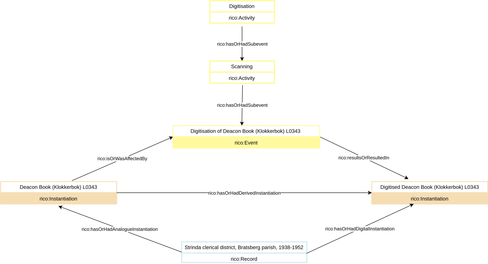
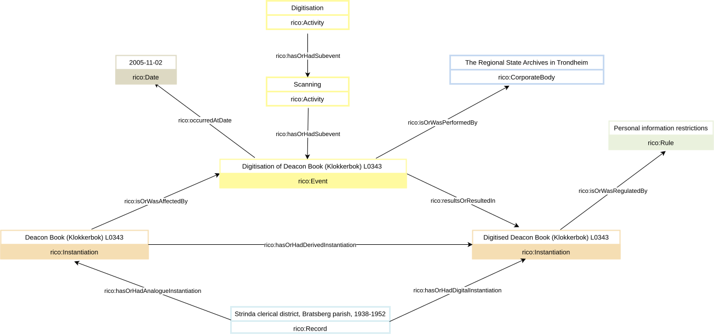
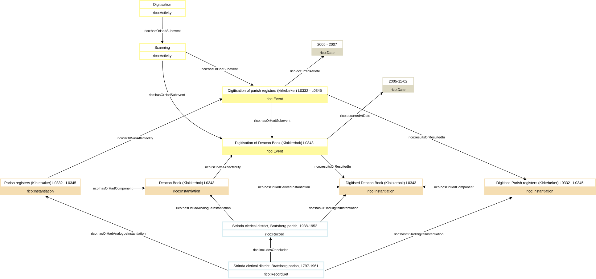

How can I model digitisation?
============================

Does one digitise a record resource or an instantiation of it?
--------------------------------------------------------------

We suggest that one typically digitises an Instantiation (RiC-E06). To see why, consider the purposes of digitisation. It may make a Record Resource (RiC-E02) more widely available: online, or via another electronic channel. Or it may contribute to more robust preservation of the Record Resource: storing it in another medium. In both cases, the intellectual aspect of the Record Resource — the information it holds — is essentially unaltered; only the means of inscription of that information, that is to say its instantiation, has changed.

That said, a digitisation might subsequently be enriched intellectually. Suppose for example one were  to take a Record (RiC-E04) which is a certain text, and digitise it to a format which includes the possibility of making comments. Suppose that one indeed does then add comments in various places. The resulting file could certainly be regarded as an instantiation of a new Record. Nevertheless, we suggest not to view this kind of enrichment as part of digitisation itself.

Digitisation as an activity
---------------------------

Digitisation can be understood very broadly, encompassing all kinds of media (visual, audio, and so on) and mechanisms: not only scanning of a text, say, but human transcription (working from a non-electronic source) of it could be seen to fall under it. At this level, digitisation can be modelled as an Activity (RiC-E15).

A specific form of digitisation such as scanning too can be modelled as an Activity. It can be related to the Activity of digitisation as a whole by _is or was subevent of_ (RiC-R006i) or its inverse _has or had subevent_ (RiC-R006).

Digitisation as an event
-------------------------

The digitisation of a particular Instantiation (RiC-E06) can be modelled by an Event (RiC-E14). This Event can be related to the Activity of digitisation described above — or, better, one of its more specific forms, such as the Activity of scanning — by _is or was subevent of_ (RiC-R006i) or its inverse (RiC-R006).

Furthermore, _is or was affected by_ (RiC-R059i) or its inverse _affects or affected_ (RiC-R059) can be used to relate the original Instantiation to the digitisation Event, whilst _results or resulted in_ (RiC-R061) or its inverse _results or resulted from_ (RiC-R061i) can be used to relate the digitisation Event to the digitised Instantiation one ends up with.

In addition, we suggest use of _has or had derived instantiation_ (RiC-R014) to relate the original Instantiation to the digitised one. Putting everything together, we end up with an example as follows, for which we provide a [RiC-O formulation](../ric-o_examples/digitisation--basic.owl).

In the example, we make use of _rico:hasOrHadAnalogueInstantiation_ and _rico:hasOrHadDigitalInstantiation_, which are currently available only in RiC-O, not in RiC-CM. In RiC-CM, one can simply use _has or had instantiation_ (RiC-R025) in both cases.

Richer modelling
----------------

A number of other attributes and relations can be made use of to enrich a basic modelling of digitisation as above. For example:

- _is or was performed by_ (RiC-R060) or its inverse _performs or performed_ (RiC-R060i), for expressing who carried out the digitisation, or for which software or hardware was used, recalling the possibility of a Mechanism (RiC-E13) as Agent;
- _occurred at date_ (RiC-R084) or its inverse _is date of occurrence of_ (RiC-R084i), for expressing when the digitisation took place;
- _is or was regulated by_ (RiC-R063i) or its inverse _regulates or regulated_ (RiC-R063), for referring to an institutional policy, perhaps derived from funding, under whose umbrella the digitisation falls, or to laws or policies which govern the use of the digitised instantiation.

The example below, for which we provide a [RiC-O formulation](../ric-o_examples/digitisation--enriched.owl), illustrates this. Other uses of _is or was regulated by_ (RiC-R063i) might have the digitisation Event as their domain rather than the digitised Instantiation.

If the digitised instantiation in this example were in such a format as to allow for comments, and if it were to be annotated through such comments so as to be able to be judged, as per the discussion above, an instantiation of a new record, one can as alway, use  _has or had instantiation_ (RiC-R025) or its inverse _is or was instantiation of_ (RiC-R025i) to relate the new record to its instantiation. In addition, _has genetic link to record resource_ (RiC-R023) can be used to relate the original record to the new one. The following example illustrates this. We provide a [RiC-O formulation](../ric-o_examples/digitisation--basic--new_record.owl).

Digitisation of a Record Part or Record Set
-------------------------------------------

Though we have focused above upon an Instantiation of a Record (RiC-E04), everything could equally have been said for an instantiation of a Record Part (RiC-E05). It alse makes sense to speak of digitisation of an instantiation of a Record Set (RiC-E03). The nuances of the semantics are slightly different, but the modelling we have described above still goes through, noting the following:

- The entity Date (RiC-E18) encompasses both single dates and periods of time, the two being distinguished by Date Type (RiC-A42). A period of time is likely to be appropriate when modelling digitisation of a Record Set.
- The relation _is or was performed by_ (RiC-R060) is many-to-many, and thus, if the digitisation of a Record Set was carried out by several agents, there is no barrier to including all of them through several applications of this relation. The same goes for many other relations.
- As ever, one can relate the digitisation of an Instantiation of a Record Set to a digitisation of an Instantiation of a Record within this Record Set by means of the _has or had component_ (RiC-R004) relation or its inverse _is or was component of_ (RiC-R004i).

The example below illustrates some aspects of this. We provide a [RiC-O formulation](../ric-o_examples/digitisation--record_set.owl).

[{ width=100% }](../diagrams/digitisation--record_set.svg)
